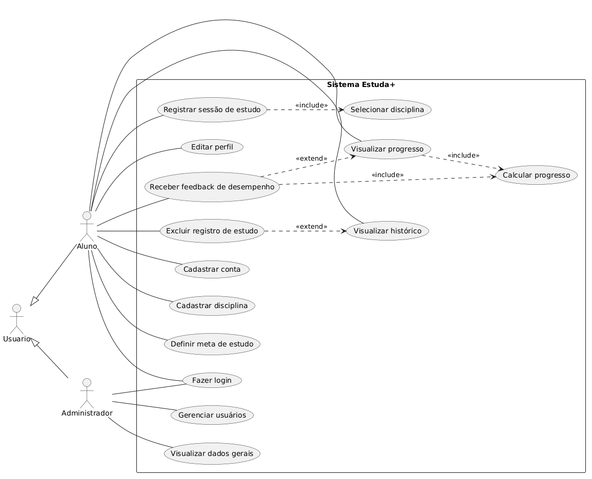

# Casos de Uso – Estuda+

## Atores
- Usuário
- Aluno
- Administrador

## Casos de Uso do Aluno
- Cadastrar conta
- Fazer login
- Cadastrar disciplina
- Definir meta de estudo
- Registrar sessão de estudo
- Visualizar progresso
- Visualizar histórico
- Editar perfil
- Excluir registro de estudo
- Receber feedback de desempenho

## Casos de Uso do Administrador
- Fazer login
- Gerenciar usuários
- Visualizar dados gerais

## Relacionamentos utilizados
### Include
- Registrar sessão de estudo inclui Selecionar disciplina
- Visualizar progresso inclui Calcular progresso
- Receber feedback de desempenho inclui Calcular progresso

### Extend
- Excluir registro de estudo estende Visualizar histórico
- Receber feedback de desempenho estende Visualizar progresso

### Generalização
- Usuário é generalização de Aluno e Administrador

## Diagrama

## Diagrama
Inserir aqui a imagem exportada do diagrama de casos de uso.
